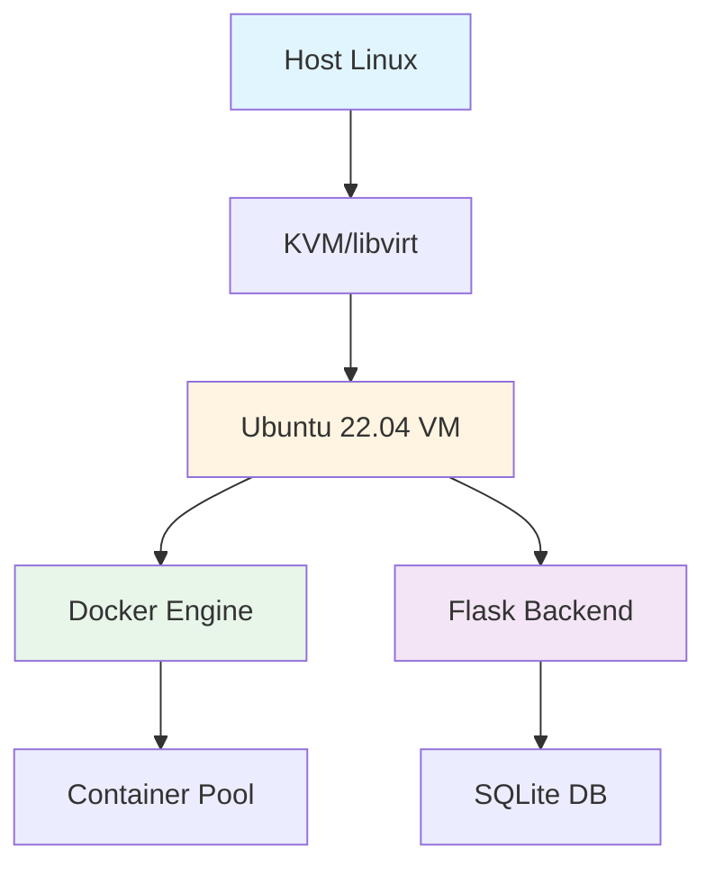

# Container Pool PaaS Platform

[](https://opensource.org/licenses/MIT)
[](https://www.python.org/downloads/)
[](https://flask.palletsprojects.com/)
[](https://www.docker.com/)
[](https://www.vagrantup.com/)
[](https://www.ansible.com/)
[](https://www.linux.org/)

> A lightning-fast Platform-as-a-Service (PaaS) system featuring pre-built container pools for instant provisioning in under 1 second. Deploy Nginx, Apache, Python, and Node.js applications with automatic recovery and zero-downtime management.

---

## Table of Contents

- [Overview](#overview)
- [Key Features](#key-features)
- [Architecture](#architecture)
- [Quick Start](#quick-start)
- [Installation](#installation)
- [Usage Guide](#usage-guide)
- [Administration](#administration)
- [Configuration](#configuration)
- [Development](#development)
- [Troubleshooting](#troubleshooting)
- [Project Structure](#project-structure)
- [Roadmap](#roadmap)
- [Contributing](#contributing)
- [License](#license)

---

## Overview

Container Pool PaaS is an educational platform demonstrating modern infrastructure-as-code principles through a production-ready container orchestration system. Built on KVM, Docker, and Flask, it showcases instant provisioning, automatic recovery, and pool-based resource management.

### Why This Platform?

- **Instant Provisioning**: Sub-second container assignment from pre-warmed pools
- **Self-Healing**: Automatic monitoring and recovery of failed containers
- **Multi-Runtime Support**: Nginx, Apache, Python 3.10, and Node.js 18
- **Production Patterns**: Demonstrates enterprise-grade infrastructure automation
- **Educational Focus**: Clear code, comprehensive docs, and best practices

---

## Key Features

### Container Pool System

| Feature | Description |
|---------|-------------|
| **Instant Provisioning** | Pre-built pools enable <1s assignment |
| **Multiple Runtimes** | Nginx, Apache, Python, Node.js |
| **Dynamic Scaling** | Add containers without downtime |
| **Automatic Reset** | Fresh state on release |
| **Auto-Recovery** | Self-healing with monitoring every 2 minutes |

### User Features

- Secure JWT-based authentication
- One-click container deployment
- File upload for static/dynamic content
- Real-time status monitoring
- Unique port-based access
- Automatic failover on container issues

### Admin Features

- Interactive CLI management
- User and container administration
- Pool health monitoring
- Batch operations support
- Comprehensive logging

---

## Architecture

### Technology Stack



| Layer | Technology |
|-------|------------|
| **Host OS** | Arch / Debian / Ubuntu / RedHat |
| **Hypervisor** | KVM with libvirt |
| **Virtualization** | Vagrant + Ubuntu 22.04 LTS |
| **Provisioning** | Ansible playbooks |
| **Backend** | Flask (Python 3.10+) |
| **Database** | SQLite with SQLAlchemy ORM |
| **Containers** | Docker 20.10+ |
| **Monitoring** | systemd timers + Python |

### Network Topology

| Component | Address Range | Purpose |
|-----------|---------------|---------|
| **VM Gateway** | <VM_IP> | Main access point |
| **Flask API** | Port 5000 | Web interface |
| **Nginx Pool** | 8000-8099 | Web server containers |
| **Apache Pool** | 8100-8199 | Alternative web server |
| **Python Pool** | 8200-8299 | Python applications |
| **Node.js Pool** | 8300-8399 | JavaScript applications |

---

## Quick Start

### Prerequisites

- Linux host (Arch, Debian/Ubuntu, or RedHat-based)
- CPU with virtualization support (VT-x/AMD-V enabled)
- 8GB RAM recommended (4GB minimum)
- 20GB free disk space

### Installation (5 Minutes)

```bash
# 1. Install system dependencies
chmod +x requirements.sh
./requirements.sh

# 2. Verify prerequisites
./setup.sh

# 3. Deploy the platform
cd infrastructure
vagrant up

# 4. Access the platform
# Open http://<VM_IP>:5000 in your browser
```

**That's it!** The platform will be running with 13 pre-initialized containers.

---

## Installation

### Step 1: System Requirements Installation

The automated installer handles all dependencies:

```bash
chmod +x requirements.sh
./requirements.sh
```

**Installs:**
- Vagrant (VM orchestration)
- Ansible (configuration management)
- libvirt + KVM (hardware virtualization)
- QEMU (machine emulator)
- dnsmasq (DHCP/DNS services)
- vagrant-libvirt plugin
- Bridge utilities and networking tools

> **⚠️ Important**: After installation, log out and back in for group permissions to take effect.

### Step 2: Prerequisite Verification

```bash
chmod +x setup.sh
./setup.sh
```

This validates:
- ✅ Vagrant installation
- ✅ libvirt service status
- ✅ User group membership
- ✅ Virtualization support
- ✅ Network configuration

### Step 3: Platform Deployment

```bash
cd infrastructure
vagrant up
```

**First-time deployment** (5-10 minutes):
1. Downloads Ubuntu 22.04 base image
2. Creates KVM virtual machine
3. Runs Ansible provisioning playbooks
4. Installs Docker and Python environment
5. Deploys Flask application
6. Initializes container pools (13 containers)
7. Starts auto-recovery monitoring
8. Launches web service

---

## Usage Guide

### Accessing the Platform

| Method | URL | Use Case |
|--------|-----|----------|
| **Direct VM** | http://<VM_IP>:5000 | Production access |
| **Localhost** | http://localhost:5000 | Development/testing |

### User Workflow

#### Step 1: Register an Account
Navigate to `/register` and create your credentials:
- Username (alphanumeric)
- Email address
- Secure password

#### Step 2: Login
Authenticate with your credentials at `/login`

#### Step 3: Launch Container
- Select runtime type (Nginx, Apache, Python, Node.js)
- Instant assignment from pool (<1 second)
- Receive unique port and access URL

#### Step 4: Upload Content (Optional)
**For web servers (Nginx/Apache):**
- HTML, CSS, JavaScript files
- Images (PNG, JPG, GIF)
- Static assets

**For application servers (Python/Node.js):**
- Application code
- Dependencies
- Configuration files

#### Step 5: Access Your Container
Use the provided URL: `http://<VM_IP>:<your-port>`

#### Step 6: Release When Done
Return container to pool for other users

---

## Administration

### Interactive Admin Helper

The easiest way to manage the platform:

```bash
./admin.sh
```

Or directly on the VM:

```bash
ssh vagrant@<VM_IP>  # Password: vagrant
sudo /opt/my-paas/admin_helper.sh
```

### Admin Operations

| Category | Available Operations |
|----------|---------------------|
| **Users** | List users, delete user accounts |
| **Containers** | View pool status, show assignments, release/delete containers |
| **Pool** | Add containers, configure sizes, reinitialize pool |
| **Monitoring** | View status, check logs, monitor health |
| **System** | Service control, database access |

### Common Administrative Tasks

**Check Pool Health:**
```bash
ssh vagrant@<VM_IP> \
  "cd /opt/my-paas && source venv/bin/activate && python pool_manager.py --status"
```

**Add More Containers:**
```bash
./admin.sh
# Navigate: Pool Management → Add Containers → Select Type → Enter Count
```

**View User Assignments:**
```bash
./admin.sh
# Navigate: Container Management → View Assigned Containers
```

**Release All User Containers:**
```bash
./admin.sh
# Navigate: Container Management → Release All for User → Enter Username
```

**Monitor Auto-Recovery:**
```bash
# Check monitoring service
ssh vagrant@<VM_IP> "systemctl status container-monitor.timer"

# View recovery logs
ssh vagrant@<VM_IP> "tail -f /opt/my-paas/container_monitor.log"
```

---

## Configuration

### Container Pool Sizes

Default configuration (customizable via admin interface):

```
nginx=5    # Ports 8000-8004
apache=3   # Ports 8100-8102
python=3   # Ports 8200-8202
node=2     # Ports 8300-8301
```

**Configuration file:** `/opt/my-paas/pool_config.txt`

### Auto-Recovery Settings

| Parameter | Default | Description |
|-----------|---------|-------------|
| Check Interval | 2 minutes | Container health check frequency |
| Recovery Mode | Automatic | Replaces failed containers |
| File Preservation | Enabled | Maintains user uploads |
| Logging | Enabled | Records all recovery actions |

**View monitoring configuration:**
```bash
ssh vagrant@<VM_IP> "sudo bash /opt/my-paas/monitor_helper.sh"
```

See [CONTAINER_MONITORING.md](CONTAINER_MONITORING.md) for complete documentation.

### VM Resource Allocation

Edit `infrastructure/Vagrantfile`:

```ruby
config.vm.provider :libvirt do |libvirt|
  libvirt.memory = 2048  # RAM in MB
  libvirt.cpus = 2       # CPU cores
end
```

Apply changes:
```bash
cd infrastructure
vagrant reload --provision
```

---

## Development

### VM Management Commands

```bash
# Access VM shell
cd infrastructure && vagrant ssh

# View application logs
ssh vagrant@<VM_IP> "cat /opt/my-paas/flask.log"

# Restart Flask service
ssh vagrant@<VM_IP> \
  "sudo systemctl restart flask-app"

# Check Docker containers
ssh vagrant@<VM_IP> "docker ps -a"
```

### Database Operations

```bash
ssh vagrant@<VM_IP>
cd /opt/my-paas && source venv/bin/activate
python

>>> from app import app, db, User, Container
>>> app.app_context().push()
>>> 
>>> # Query all users
>>> User.query.all()
>>> 
>>> # Query containers
>>> Container.query.filter_by(status='assigned').all()
```

### Backup & Restore

**Create backup:**
```bash
scp vagrant@<VM_IP>:/opt/my-paas/instance/paas_platform.db \
    ./backup-$(date +%Y%m%d).db
```

**Restore from backup:**
```bash
scp ./backup-20250112.db vagrant@<VM_IP>:/tmp/
ssh vagrant@<VM_IP> \
  "sudo cp /tmp/backup-20250112.db /opt/my-paas/instance/paas_platform.db && \
   sudo systemctl restart flask-app"
```

---

## Troubleshooting

### VM Won't Start

**Check libvirt service:**
```bash
sudo systemctl status libvirtd
sudo systemctl start libvirtd
sudo systemctl enable libvirtd
```

**Verify user groups:**
```bash
groups  # Should include 'libvirt'

# If not present, add and re-login:
sudo usermod -a -G libvirt $USER
```

### Can't Access Web Interface

**Verify Flask is running:**
```bash
ssh vagrant@<VM_IP> "pgrep -f 'flask run'"
```

**Check VM network:**
```bash
cd infrastructure
vagrant ssh -c "ip addr show"
ping <VM_IP>
```

**Restart Flask manually:**
```bash
ssh vagrant@<VM_IP> \
  "cd /opt/my-paas && source venv/bin/activate && \
   pkill -f 'flask run'; \
   nohup flask run --host=0.0.0.0 > flask.log 2>&1 &"
```

### Empty Container Pool

**Check pool status:**
```bash
./admin.sh  # Select: Container Management → Show Pool Status
```

**Reinitialize pool:**
```bash
ssh vagrant@<VM_IP> \
  "cd /opt/my-paas && source venv/bin/activate && \
   python pool_manager.py --init"
```

### Port Conflicts

**List all containers:**
```bash
ssh vagrant@<VM_IP> "docker ps -a"
```

**Clean orphaned containers:**
```bash
ssh vagrant@<VM_IP> "docker container prune -f"
```

---

## Project Structure

```
platform-deployment/
├── README.md                      # This file
├── LICENSE                        # MIT license
├── COMMANDS.sh                    # Quick command reference
├── CONTAINER_MONITORING.md        # Auto-recovery documentation
├── Makefile                       # Build automation
│
├── requirements.sh                # System dependency installer
├── setup.sh                       # Prerequisites checker
├── admin.sh                       # Admin helper wrapper
│
├── infrastructure/
│   ├── Vagrantfile                   # VM configuration (KVM/libvirt)
│   └── site.yml                      # Ansible provisioning playbook
│
└── app/
    ├── app.py                        # Flask application (main)
    ├── pool_manager.py               # Container pool CLI
    ├── container_monitor.py          # Auto-recovery daemon
    ├── admin_helper.sh               # Interactive admin interface
    ├── monitor_helper.sh             # Monitor management CLI
    ├── requirements.txt              # Python dependencies
    │
    ├── templates/                    # Jinja2 HTML templates
    │   ├── base.html
    │   ├── login.html
    │   ├── register.html
    │   ├── dashboard.html
    │   └── upload.html
    │
    └── static/                       # CSS, JavaScript, images
        ├── css/
        ├── js/
        └── img/
```

---

## Roadmap

### Version 2.0 (Planned)

- [ ] Custom Docker images via Dockerfile upload
- [ ] Persistent container storage with volume management
- [ ] Resource limits (CPU, memory quotas per user)
- [ ] Real-time container log streaming
- [ ] SSL/TLS certificate automation
- [ ] User quotas and rate limiting
- [ ] Docker Compose support for multi-container apps
- [ ] Grafana/Prometheus monitoring integration
- [ ] Load balancer for container distribution
- [ ] Blue-green deployment support

### Version 3.0 (Future)

- [ ] Kubernetes migration path
- [ ] Multi-region container distribution
- [ ] AI-powered resource optimization
- [ ] Mobile app for container management
- [ ] Plugin system for extensibility

---

## Contributing

We welcome contributions! This project is designed for learning and collaboration.

### How to Contribute

1. Fork the repository
2. Create a feature branch (`git checkout -b feature/amazing-feature`)
3. Make your changes with clear commits
4. Test thoroughly in a VM environment
5. Push to your fork (`git push origin feature/amazing-feature`)
6. Open a Pull Request

### Development Guidelines

- Follow PEP 8 for Python code
- Add tests for new features
- Update documentation for changes
- Use meaningful commit messages

---

## Acknowledgments

Built with these excellent open-source projects:

- [Flask](https://flask.palletsprojects.com/) - Web framework
- [Docker](https://www.docker.com/) - Container runtime
- [Vagrant](https://www.vagrantup.com/) - VM orchestration
- [Ansible](https://www.ansible.com/) - Configuration management
- [KVM](https://www.linux-kvm.org/) - Kernel-based virtualization
- [Ubuntu](https://ubuntu.com/) - Operating system

---

<div align="center">

**Star this repo if you find it useful!**

Made with care for the DevOps community

[Report Bug](https://github.com/yourusername/container-pool-paas/issues) · [Request Feature](https://github.com/yourusername/container-pool-paas/issues) · [Documentation](https://github.com/yourusername/container-pool-paas/wiki)

</div>
