# Container Pool PaaS Platform - Architecture Diagrams

## 1. High-Level System Architecture


## 2. Container Pool Lifecycle

```mermaid
stateDiagram-v2
    [*] --> Available: Pool Initialization
    
    Available --> Assigned: User Launches Container
    Assigned --> Available: User Releases Container
    Assigned --> Failed: Container Crashes
    Failed --> Available: Monitor Recovers
    
    Available --> Stopped: Docker Issue
    Stopped --> Available: Monitor Restarts
    
    note right of Available : Labels: pool=true, status=available"
    note right of Assigned : Labels: pool=true, status=assigned", user_id=X
    note right of Failed : Container missing from Docker
```

## 3. User Request Flow


## 4. Container Recovery Flow


## 5. File Upload Flow

```mermaid
sequenceDiagram
    actor User
    participant Browser
    participant Flask as Flask App
    participant FS as File System
    participant Docker as Docker Daemon
    participant Container as User Container

    User->>Browser: Select files to upload
    Browser->>Flask: POST /upload/container_id (files[])
    Flask->>Flask: Validate file extensions
    Flask->>FS: Save files to /opt/my-paas/user_files/user_id/container_id/
    FS-->>Flask: Files saved
    Flask->>Docker: Stop current container
    Flask->>Docker: Remove container
    Flask->>Docker: Run with volume mount
    Note over Docker: Volume: user_files → /usr/share/nginx/html
    Docker-->>Flask: New container ID & port
    Flask->>Flask: Update database
    Flask-->>Browser: Redirect with success message
    
    User->>Browser: Access container
    Browser->>Container: GET /index.html
    Container->>Container: Read from mounted volume
    Container-->>Browser: User's HTML file
```



## 6. Component Dependencies


## 7. Network Architecture


## 8. Database Schema


## 9. Pool Container Labels


## 10. Deployment Pipeline


## 11. Admin Operations Flow


## 12. Complete System Overview


---

## How to View These Diagrams

1. **VS Code**: Install the "Markdown Preview Mermaid Support" extension
2. **GitHub**: Mermaid diagrams render automatically in markdown files
3. **Online**: Use [Mermaid Live Editor](https://mermaid.live/)
4. **CLI**: Use `mmdc` (mermaid-cli) to generate PNG/SVG files

```bash
# Install mermaid-cli
npm install -g @mermaid-js/mermaid-cli

# Generate PNG
mmdc -i diagram.md -o diagram.png
```
